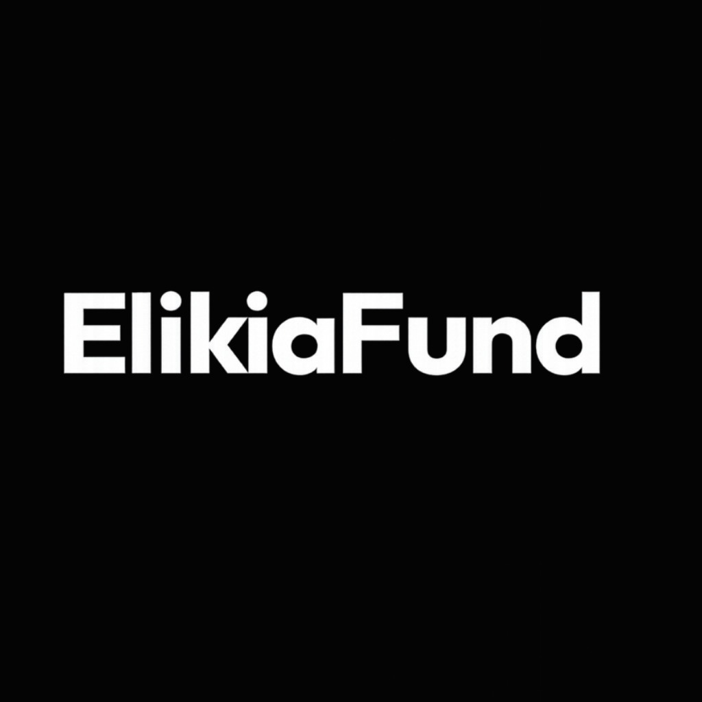

  

  # Elikia Fund

  <em>Une identité financière pour les commerces qu'aucune banque n'a jamais vus.</em>

 

*Elikia* signifie espoir, en lingala.

À travers le Congo-Brazzaville — et une grande partie de l'économie informelle africaine — des commerçants font tourner de vraies entreprises avec du cash, de la mémoire et de la confiance. Une commerçante note ses ventes dans un cahier, quand elle prend le temps de les noter. Elle épargne en confiant du cash à une tontine, un cercle d'épargne rotatif qui ne tient que sur la parole de ses voisins. Le jour où elle a besoin d'un crédit pour se développer, il n'existe aucun relevé bancaire à montrer, aucun bureau de crédit qui la connaît — rien qu'une réputation qui ne dépasse jamais sa propre rue.

Elikia Fund existe pour changer ce que cette réputation peut faire. L'application transforme la discipline que ces commerçants pratiquent déjà — être présents, cotiser, tenir leurs comptes — en quelque chose qu'ils peuvent enfin montrer.

  <a href="#ce-que-fait-elikia-fund">Ce que fait Elikia Fund</a> ·
  <a href="#les-applications">Les applications</a> ·
  <a href="#pour-les-développeurs">Pour les développeurs</a> ·
  <a href="#documentation">Documentation</a>

---

## Ce que fait Elikia Fund

**Un journal de caisse, tenu simplement.** Ventes et dépenses au quotidien, un catalogue produits avec un vrai calcul de coût et de marge, une session de caisse pour ouvrir et fermer la journée — tout fonctionne d'abord hors ligne, parce que la connexion d'une boutique ne devrait jamais décider si sa gérante peut tenir ses comptes.

**Un coffre d'épargne, protégé par un code PIN.** De l'argent réel, déplacé via MTN Mobile Money et Airtel Money — chaque dépôt et chaque retrait enregistrés comme le ferait un relevé bancaire, pas griffonnés dans un cahier puis oubliés.

**Des tontines, numérisées.** La même pratique d'épargne rotative que des millions de personnes connaissent déjà, sans le papier : rappels automatiques, historique des cotisations visible par tout le groupe, quatre façons différentes de désigner qui reçoit la cagnotte à chaque tour — plus un mode à objectif, pour un groupe qui épargne vers un même but plutôt que de tourner entre ses membres.

**Un score de crédit construit sur des comportements réels.** Chaque entreprise obtient son propre score, calculé à partir de sa régularité d'épargne, de sa gestion de trésorerie, de son assiduité dans sa tontine — pas d'un bureau de crédit qui n'a jamais été conçu pour la voir. Ce score alimente un vrai dossier de crédibilité financière, exportable, qu'un commerçant peut présenter à un prêteur.

Une même personne peut gérer plusieurs entreprises, chacune avec ses propres comptes, son propre coffre, ses propres tontines et son propre score — la deuxième entreprise d'une commerçante est sa propre histoire financière, pas une note de bas de page de la première.

## Les applications

- **L'application que les commerçants utilisent au quotidien** — comptabilité, coffre, tontines, entièrement en français, conçue pour continuer à fonctionner que la connexion soit là ou non.
- **Le tableau de bord que notre équipe utilise** — tout ce dont le personnel a besoin pour accompagner les commerçants, gérer les tontines et consulter les scores de crédit, avec de vrais rôles d'accès pour que chaque membre du support et chaque administrateur ne voie que ce qu'il doit voir.
- **Le site web** — là où les gens découvrent l'histoire d'Elikia Fund pour la première fois.

---

## Pour les développeurs

Un monorepo : une API Laravel, trois clients qui s'y connectent.

### Stack

| Application | Stack | Documentation |
|---|---|---|
| [`api/`](api) | Laravel 13 + Sanctum + MySQL | [`api/README.md`](api/README.md) |
| [`mobile/`](mobile) | Expo (React Native + TypeScript) | [`mobile/README.md`](mobile/README.md) |
| [`back-office/`](back-office) | Vite + React + shadcn/ui | [`back-office/README.md`](back-office/README.md) |
| [`website/`](website) | Next.js (App Router) | [`website/README.md`](website/README.md) |

### Démarrage rapide

1. **API** — créez une base de données MySQL locale nommée `elikia_fund`, puis suivez [`api/README.md`](api/README.md). Servie sur `http://localhost:8000/api`.
2. **Mobile** — suivez [`mobile/README.md`](mobile/README.md). La connexion Google/Facebook nécessite un dev client personnalisé, pas Expo Go — la connexion Apple fonctionne dans Expo Go.
3. **Back-office** — suivez [`back-office/README.md`](back-office/README.md). Connectez-vous avec un compte membre du personnel déjà créé (seed).
4. **Site web** — suivez [`website/README.md`](website/README.md). Servi sur `http://localhost:3000`.

### Points forts de l'architecture

- **Tout est isolé par entreprise.** Le flux de trésorerie, le coffre, les tontines et le score de crédit sont tous rattachés à une entreprise, jamais directement à une personne — un utilisateur avec deux entreprises obtient deux identités financières totalement séparées. La seule exception délibérée : le code PIN du coffre appartient à la personne, une base pour permettre plus tard à plusieurs personnes de partager le coffre d'une même entreprise.
- **Flux de trésorerie hors ligne d'abord.** L'application mobile lit en direct dès qu'elle est connectée et bascule sur un cache SQLite local sinon, puis resynchronise dès que la connexion revient — la seule fonctionnalité construite ainsi, car c'est la seule qui ne peut pas se permettre d'attendre un signal.
- **De l'argent mobile réel, pas une simulation.** Une intégration complète avec Yabeto Pay (MTN Mobile Money, Airtel Money) — voir [`yabeto.md`](yabeto.md) pour la référence complète du fournisseur de paiement — avec un mode simulé de secours pour que le reste de l'application reste entièrement testable sans identifiants réels.
- **Un moteur de score de crédit configurable.** Une grille de notation pondérée sur un ensemble fixe de facteurs (ancienneté du compte, régularité des transactions, comportement d'épargne, ratio revenus/dépenses, participation aux tontines, profil d'entreprise), ajustable depuis le back-office sans redéploiement.
- **Un vrai back-office, pas une pensée après coup.** Une gestion complète des rôles et permissions, un tableau de données réutilisable sur chaque page d'administration, et une confirmation par mot de passe avant toute suppression.

### Documentation

- [`fintech-mvp-one-week-plan.md`](fintech-mvp-one-week-plan.md) — le périmètre initial du sprint et le plan jour par jour.
- [`yabeto.md`](yabeto.md) — la référence complète du fournisseur de paiement mobile money.
- Le README de chaque application pour son installation, sa structure et ses commandes courantes.

## Langue

Tout le contenu mobile, back-office et site web est en français.
